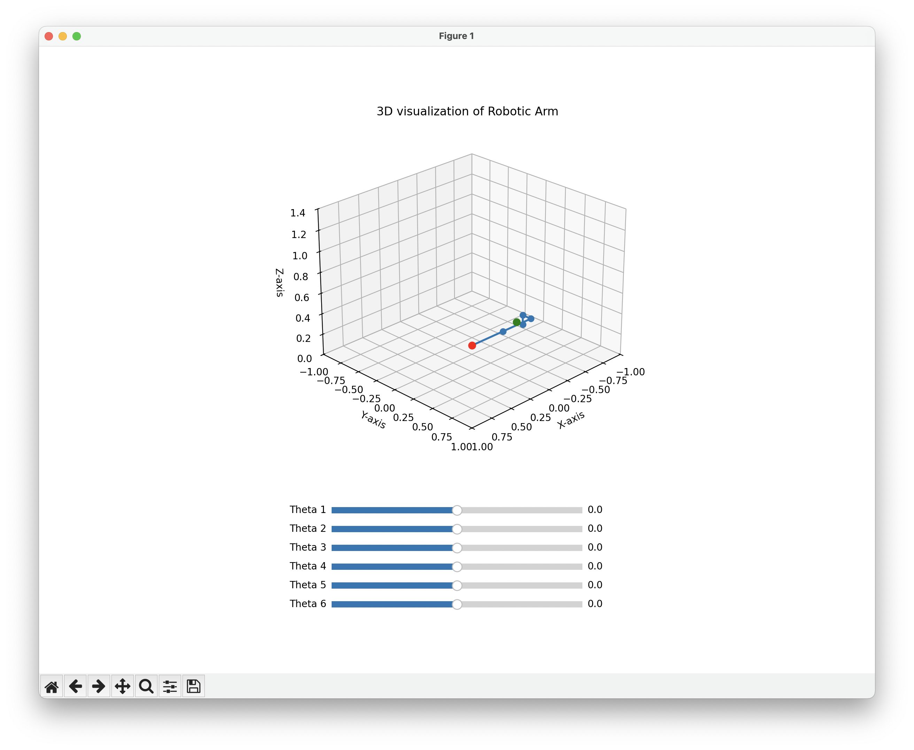

# 🦾실시간으로 조작가능한 로봇 시뮬레이션 프로그램

## 프로젝트 설명

로봇 정기구학(Forward Kinematics)은 로봇 개발 및 설계에서 필수적인 이론으로, 로봇의 운동을 이해하고 제어하는 데 필요한 기초 지식을 제공합니다.  

이 프로젝트의 목표는 Forward Kinematics알고리즘을 활용해  로봇의 동작을 시뮬레이션할 수 있는 프로그램을 개발하여 수치화된 성과를 창출하는 것입니다.

## 요청내용

- **6자유도 로봇에 대한 DH 파라미터 정의
- **DH 변환 행렬 계산 (**각 DH 파라미터를 기반으로 변환 행렬을 계산하는 코드를 구현)
- **Forward Kinematics (**DH 변환 행렬을 **결합해** 로봇의 끝단 (end effector) 위치 계산)
- **시뮬레이션 프로그램 제작 (**로봇의 동작을 시각화할 수 있는 시뮬레이션 프로그램을 개발)

## 사용 기술

- 프로그래밍 언어 : Python
  - Python matplotlib, Slider, Rotation, numpy
- 수학적 모델 : DH 파라미터(Denavit-Hartenberg), 정기구학(Forward Kinematics)

## 주요 기능

- 6DOF 로봇 팔의 DH파라미터로 정기구학 구현
- matplotlib, Slider, Rotation, numpy 라이브러리를 활용한 실시간 시뮬레이션
- End Effector의 postion과 orientation 계산

## 성과

- 시간 단축 : 로봇 시뮬레이션을 통해 동작 범위를 미리 확인해 설계 시간 40% 단축
- 비용 절감 : 실제 로봇 시스템 구현 전에 시뮬레이션으로 설계 비용 절감

## 이미지

